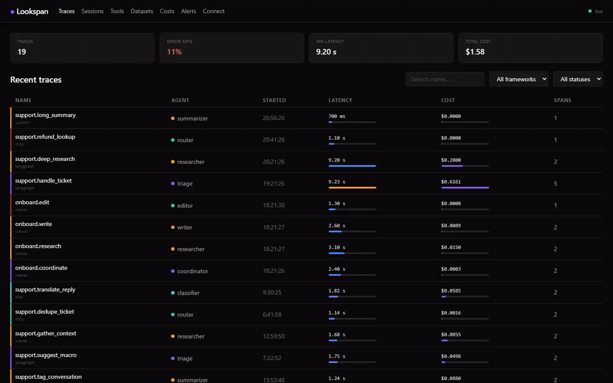

# Lookspan

**Dashboard de observabilidad local-first para agentes de IA. Nativo para MCP. Mira cada span que emiten tus agentes.**

[](https://github.com/JoniMartin27/lookspan/actions/workflows/ci.yml)
[](https://www.npmjs.com/package/lookspan)
[](./LICENSE)
[](https://nodejs.org)

```bash
npx lookspan          # → http://127.0.0.1:3100
```

<!-- TODO: grabar y enlazar un GIF de 30s aquí (npx lookspan → correr un agente → ver spans en vivo). Ver docs/ROADMAP.md. -->
<!--  -->

```
Agente (MCP · LangGraph · CrewAI · OpenTelemetry · HTTP)  →  POST /api/ingest  →  SQLite  →  Dashboard en tiempo real
```

> 🇬🇧 Prefer English? Read the [English README](README.md).

---

## El problema

Cuando un agente de IA falla —o tarda demasiado, o gasta más tokens de lo esperado—
no hay forma nativa de ver qué ocurrió paso a paso. Las herramientas existentes son
cloud-first: piden cuentas, claves de API y enviar tus datos de producción a
servidores ajenos.

Lookspan hace lo contrario: **todo corre en tu máquina, los datos nunca salen de
ella, y el coste de infraestructura es cero.** Instrumenta tu agente con un
adaptador (o solo haz `POST` de JSON) y abre el dashboard en el navegador.

---

## Inicio rápido

```bash
npx lookspan              # → http://127.0.0.1:3100, sin instalar, sin nube
```

Envía tu primer span desde cualquier lenguaje:

```bash
curl -X POST http://127.0.0.1:3100/api/ingest \
  -H "Content-Type: application/json" \
  -d '{"spans":[{"traceId":"t1","spanId":"s1","parentSpanId":null,"type":"llm_call","name":"agent.run","startedAt":"2026-06-02T10:00:00Z","endedAt":"2026-06-02T10:00:01Z","status":"ok","framework":"custom","model":"gpt-4o","provider":"openai","usage":{"inputTokens":1000,"outputTokens":500,"costUsd":0}}]}'
```

Abre `http://127.0.0.1:3100` y verás la traza aparecer — con su coste calculado en el servidor.

---

## Características

- **Ingesta de spans por HTTP** — `POST /api/ingest` acepta batches JSON. Compatible con cualquier agente que pueda hacer una petición HTTP.
- **Nativo para MCP** — el SDK TypeScript `@lookspan/mcp` envuelve cualquier `McpClient` y emite un span por llamada a herramienta MCP, sin tocar el código del agente.
- **SDKs Python** — `lookspan` (cliente genérico) + adaptadores para LangGraph/LangChain (`lookspan-langgraph`) y CrewAI (`lookspan-crewai`).
- **OpenTelemetry** — receptor OTLP/HTTP en `POST /v1/traces`; apunta cualquier exporter OTel sin SDK propio. Los atributos `gen_ai.*` se mapean a provider/model/tokens.
- **Tiempo real** — SSE en `GET /api/stream` empuja `span.ingested`, `trace.updated` y `alert.triggered` al dashboard, sin polling.
- **Dashboard React** — trazas recientes con filtros/búsqueda; detalle con grafo de spans (React Flow); costes y overview (tasa de error, latencia p50/p95/p99, coste por día); historial de alertas.
- **Seguimiento de costes** — agrega tokens (entrada/salida/caché/razonamiento) y calcula `cost_usd` por span y traza desde una tabla de precios, sobrescribible con `--pricing`.
- **Alertas** — avisos cuando una traza falla o supera un umbral de coste/tokens/duración (toast + notificación de escritorio + CLI + historial persistido).
- **Scores de evaluación** — adjunta métricas a una traza (`POST /api/traces/:id/scores`) desde un juez LLM, un assert o a mano.
- **SQLite local** — migraciones versionadas. BD en `~/.lookspan/lookspan.db` por defecto; configurable. Retención opcional con `--retention`.
- **Seguridad** — bind a `127.0.0.1` por defecto; auth opcional `--token`; redacción de credenciales antes de persistir.
- **CLI en una línea** — `npx lookspan` arranca servidor + dashboard sin instalación global.

---

## Integración con agentes

### TypeScript / MCP

```bash
npm install @lookspan/mcp
```

```typescript
import { wrapMcpClient, HttpSpanExporter } from '@lookspan/mcp';

const exporter = new HttpSpanExporter({ endpoint: 'http://127.0.0.1:3100/api/ingest' });
const { client } = wrapMcpClient(mcpClient, { exporter, agentId: 'mi-agente' });

// Úsalo igual que antes — cada callTool emite un span tool_call.
await client.callTool({ name: 'read_file', arguments: { path: '/tmp/foo.txt' } });
await exporter.flush();
```

### Python (genérico, LangGraph, CrewAI)

```bash
pip install lookspan            # + lookspan-langgraph / lookspan-crewai
```

```python
from lookspan import LookspanClient
from lookspan_langgraph import LookspanCallbackHandler

client = LookspanClient(endpoint="http://127.0.0.1:3100/api/ingest")
handler = LookspanCallbackHandler(client=client, agent_id="mi-agente")

result = graph.invoke({"messages": []}, config={"callbacks": [handler]})
client.flush()
```

### OpenTelemetry (sin SDK)

Apunta cualquier exporter OTel al endpoint estándar:

```bash
export OTEL_EXPORTER_OTLP_TRACES_ENDPOINT=http://127.0.0.1:3100/v1/traces
# se aceptan protobuf (el default de OTel) y JSON
```

Más ejemplos ejecutables en [`examples/`](examples/).

---

## API HTTP

| Método | Ruta | Descripción |
|---|---|---|
| `GET` | `/api/health` | Estado del servicio |
| `POST` | `/api/ingest` | Ingesta de spans (body: `IngestPayload`) |
| `GET` | `/api/traces` | Lista de trazas (paginada; filtrable por `framework`, `status`, `sessionId`) |
| `GET` | `/api/traces/:id` | Detalle de una traza con sus spans y scores |
| `POST` | `/api/traces/:id/scores` | Adjunta un score de evaluación (`{name, value, comment?, source?}`) |
| `GET` | `/api/sessions` | Lista de sesiones (agentes, trazas, coste, errores, rango temporal) |
| `GET` | `/api/sessions/:id` | Resumen de la sesión + sus trazas (timeline multi-agente) |
| `GET` | `/api/costs/summary` | Desglose de costes (total, por modelo, proveedor, agente) |
| `GET` | `/api/stats` | Stats (totales, tasa de error, latencia p50/p95/p99, coste por día) |
| `GET` | `/api/alerts` | Historial de alertas disparadas |
| `GET` | `/api/stream` | Stream SSE de eventos en tiempo real |
| `POST` | `/v1/traces` | Receptor OTLP/HTTP de OpenTelemetry (JSON `ExportTraceServiceRequest`) |

---

## Opciones del CLI

```
npx lookspan [opciones]
  -p, --port <puerto>      Puerto de escucha            (por defecto: 3100)
      --host <host>        Host de escucha              (por defecto: 127.0.0.1)
      --db <ruta>          Ruta de la BD SQLite         (por defecto: ~/.lookspan/lookspan.db)
      --retention <dur>    Poda trazas anteriores a p.ej. 7d, 24h, 30m
      --token <token>      Exige Authorization: Bearer <token> en la API
      --pricing <fichero>  Tabla de precios por modelo personalizada (JSON)
      --alert-error                Alerta si una traza falla
      --alert-cost <usd>           Alerta si una traza cuesta más de <usd>
      --alert-tokens <n>           Alerta si una traza supera <n> tokens
      --alert-duration <ms>        Alerta si una traza tarda más de <ms>
      --open               Abre el dashboard en el navegador
  -h, --help               Muestra la ayuda
  -v, --version            Muestra la versión
```

Cada flag tiene equivalente por entorno `LOOKSPAN_*` (`LOOKSPAN_PORT`, `LOOKSPAN_TOKEN`, `LOOKSPAN_PRICING`, `LOOKSPAN_ALERT_*`, …).

---

## Comparación

| | **Lookspan** | Langfuse | Phoenix (Arize) |
|---|---|---|---|
| Arranque | `npx lookspan` (cero infra) | Docker + Postgres + ClickHouse | `pip install` (Python) |
| Almacenamiento | SQLite local | Postgres + ClickHouse | local / en memoria |
| Foco | stack **TS/JS + MCP** | plataforma completa (evals, prompts) | evals / RAG (Python) |
| Tus datos | nunca salen de tu máquina | self-host o nube | local o nube |
| OpenTelemetry | receptor OTLP nativo | sí | sí (OTel-native) |

Lookspan no intenta ser una plataforma completa: apuesta por ser **la capa de
observabilidad sin setup para agentes TypeScript/MCP**, con la mejor experiencia
en los primeros 5 minutos. Roadmap en [docs/ROADMAP.md](docs/ROADMAP.md).

---

## Seguridad

Lookspan escucha en `127.0.0.1` (loopback) y no requiere auth por defecto — ideal
para uso local. Si lo expones (`--host 0.0.0.0`), protégelo con un token:

```bash
LOOKSPAN_TOKEN=mi-token npx lookspan --host 0.0.0.0
# /api/* y /v1/* exigen Authorization: Bearer mi-token (/api/health queda exento).
```

El collector además **redacta** valores de claves sensibles (`authorization`,
`api_key`, `token`, `secret`, `password`, `cookie`…) en `input`/`attributes`
antes de persistir, para que la telemetría no arrastre credenciales a la BD.

---

## Desarrollo

Monorepo npm-workspaces. `packages/` son librerías internas, `apps/` el dashboard,
`python/` los SDKs Python independientes.

```bash
git clone https://github.com/JoniMartin27/lookspan.git
cd lookspan
npm install
npm run dev        # API en :3100, dashboard con hot-reload en :5173
npm run ci         # typecheck + lint + test + build
```

Contribuciones bienvenidas — ver [.github/CONTRIBUTING.md](.github/CONTRIBUTING.md).
Proceso de release en [docs/PUBLISHING.md](docs/PUBLISHING.md). Política de seguridad: [SECURITY.md](SECURITY.md).

---

## Licencia

MIT — Copyright (c) 2026 Jonathan Martin. Consulta [LICENSE](LICENSE).
